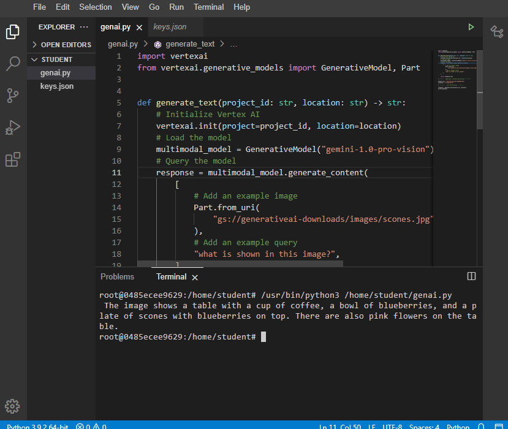

# AI Image Recognition App using Gemini on Vertex AI

This project demonstrates how to use Google's **Gemini model** on **Vertex AI** for image recognition tasks. By integrating generative AI models, this app can process an image and respond to a text-based question about the image, returning a human-like description of the content.

## Objective

The goal of this project is to:

- Connect to **Vertex AI** using the Python SDK.
- Load and interact with a **pre-trained generative AI model** (Gemini).
- Send **image and text queries** to the AI model.
- Extract and display the **textual responses** generated by the model.
- Build an AI-powered application that leverages **Google Cloud's Vertex AI** to simplify AI integrations in real-world scenarios.

## Features

- **Vertex AI Integration**: Connect seamlessly to Google Cloud’s Vertex AI platform.
- **Generative AI with Gemini**: Leverage Google's powerful pre-trained Gemini model.
- **Multimodal AI**: Combine image and text inputs to generate descriptive textual outputs.
- **AI-powered Applications**: Learn how to easily integrate AI into your software projects.
